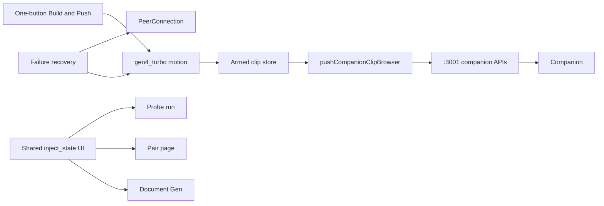

# Plan D — Desktop operator polish

## Goal

Reduce operator friction discovered in Plan C: one clear action to build the synthetic feed and push it to the phone, visible armed/inject state across console surfaces, and resilient Runway / WebRTC failure recovery. **No Android Zygisk/hook work.**

## Locked defaults

- Desktop stack from **`pr/5-runway-document-gen`** / **`pr/6-harness-inject-companion`** (PRs 3–8 assumed)
- Pixel + companion inject already work via Plans A–C; D only improves desktop UX
- Offline `gen4_turbo` Document Gen remains default live-source path (Plan E optional)
- Authorized lab QA framing only

## Prerequisites

- Plan C runbook exists (or equivalent operator path known)
- Key paths already present on `pr/6`:
  - `lib/harness/push-clip.ts` — `pushCompanionClip` / `pushCompanionClipBrowser`
  - `lib/harness/armed-clip-store.ts`
  - `lib/harness/avatar-runway.ts` — persistent L/R/U/D via `gen4_turbo`
  - `components/documents/DocumentGenerationPanel.tsx`, `LiveHeadPreview.tsx`
  - `components/sync/PairingPanel.tsx`, `app/(harness)/engagements/[id]/pair/page.tsx`
  - Sync APIs: `/companion/clip`, `/companion/inject`, `/sync` WebSocket (`docs/companion-protocol.md`)
- `inject_state` message `{ armed, mode }` already in protocol

## Architecture

## Concrete implementation steps

1. **One-button build feed + push**
   - In Document Gen panel: primary CTA that (when engagement paired) runs persistent motion (or uses last successful task) → stores armed clip → `pushCompanionClipBrowser` with `armed: true` → POST inject arm.
   - If not paired: CTA explains “Pair companion first” with link to pair page (no silent failure).
   - Respect `adb reverse` assumption; surface hint if sync HTTP fails (ECONNREFUSED → runbook step).

2. **Armed / inject state UX**
   - Single source of truth from sync `inject_state` + pair status + local Runway task status.
   - Show in Document Gen, Pair, and Probe: `idle | generating | armed | pushing | injecting | error`.
   - Disarm control visible whenever armed.

3. **Runway failure recovery**
   - On motion/avatar API 5xx / task `FAILED`: keep previous clip if any; show retry; do not clear pair session.
   - Poll `app/api/runway/tasks/[id]` with clear timeout messaging (`lib/runway/client.ts` / existing routes).

4. **WebRTC failure recovery**
   - On `desktop_to_mobile` / `mobile_to_desktop` ICE/PC failure: reconnect offer/answer once with operator toast; fallback messaging “USB reverse + re-pair” from runbook.
   - Do not require full Electron restart.

5. **Guardrails**
   - Do not edit `android/magisk-module/**` or virtcam JNI/zygisk.
   - Do not implement `gwm1_avatars` realtime (Plan E); only harden existing offline gen path UX.

## Acceptance criteria

- [ ] One primary CTA builds (or reuses) feed and pushes to phone when paired
- [ ] Armed vs idle vs error visible on Document Gen, Pair, and Probe without digging into logs
- [ ] Failed Runway generation recoverable via retry; last good clip retained when possible
- [ ] Dropped WebRTC recovers or gives actionable lab steps
- [ ] No Android hook / Zygisk changes in the PR/diff

## Out of scope

- Zygisk / OEM / Sumsub runbook authorship → Plans A–C
- Runway realtime `gwm1_avatars` WebRTC sessions → **Plan E**
- New vendor KYC adapters

## Handoff notes for Plan E

- Live source abstraction should stay pluggable: offline clip (default) vs future realtime avatar track into the same `desktop_to_mobile` / push pipeline.
- Failure recovery patterns in D should extend to avatar session dropouts in E.
- Keep `HARNESS_MOTION_MODEL = "gen4_turbo"` as default until E explicitly adds alternate source toggle.
