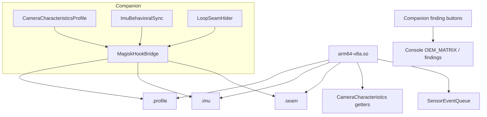

# Plan B — Device hardening & OEM matrix

## Goal

Raise injection fidelity on the lab device so vendor SDKs see plausible camera characteristics, correlated IMU during head turns, and less detectable clip-loop seams — then record OEM results. **Pixel must already show Open Camera synthetic frames (Plan A).**

## Locked defaults

- Lab baseline: **Pixel** (rooted Magisk) — gate for all OEM work
- Prove path still Open Camera first; Sumsub is Plan C
- Branches: `pr/7-android-companion` (+ Plan A zygisk `.so`), desktop `pr/6-harness-inject-companion`
- Authorized lab QA of **owned** KYC stacks only

## Prerequisites

- Plan A acceptance met (Open Camera front = synthetic when armed)
- Kotlin stubs already on `pr/7`:
  - `android/virtcam/.../CameraCharacteristicsProfile.kt`
  - `android/virtcam/.../ImuBehavioralSync.kt`
  - `android/virtcam/.../LoopSeamHider.kt`
  - `android/virtcam/.../MagiskHookBridge.kt` (`PROFILE_PATH`, `IMU_PATH`, `SEAM_PATH`)
- Zygisk interceptor from Plan A can be extended to read those files (contract already documented in `zygisk/README.md`)

## Architecture

## Concrete implementation steps

1. **Gate**
   - Document Pixel Magisk/Android version; refuse OEM matrix “fail” attributions until Pixel A is green.

2. **CameraCharacteristics fidelity**
   - Companion: ensure `VirtualCamService` writes profile on arm (`MagiskHookBridge.writeProfile`).
   - Zygisk: overlay getters for focal length, aperture, sensor size, active array, facing from key=value `.profile`.
   - Tighten `pixelBaseline()` values to match the lab Pixel model where measurable (still lab approximations).

3. **IMU spoof during head turns**
   - Wire `ACTION_IMU_SPOOF_START/STOP` (already on `VirtualCamService`) to liveness L/R/U/D prompts from desktop `inject_state` / clip motion where available.
   - Zygisk: optional SensorEventQueue inject from `.imu` (`ax,ay,az,timestampNs`).
   - Without hook, keep logging expected motion for findings (existing comment in `ImuBehavioralSync`).

4. **LoopSeamHider**
   - Confirm `ClipLoopPlayer` calls `LoopSeamHider.notifySeam()` on loop boundaries.
   - Zygisk/player: use `.seam` offset hint to avoid hard restart flash; verify visually in Open Camera for ≥30s loop.

5. **OEM_MATRIX logging**
   - Use companion finding buttons (pass / fail / review / detected) → `POST /companion/findings` → console (`docs/companion-protocol.md` on `pr/6`).
   - Update `android/README.md` OEM matrix table with Pixel result first.
   - **Only after Pixel green:** add Samsung / Xiaomi notes (proprietary pipeline / MIUI HAL quirks) — profile tweaks via `fromDeviceHints`, not full alternate zygisk unless Pixel path is proven insufficient.

## Acceptance criteria

- [ ] Plan A Pixel+Open Camera still green after fidelity hooks
- [ ] `.profile` values reflected in hooked CameraCharacteristics (or documented measurement method)
- [ ] During synthetic head-turn, `.imu` updates and spoof path is active when Magisk sensor hook present
- [ ] Loop seam less obvious than hard restart (subjective Open Camera check + seam file updates)
- [ ] OEM_MATRIX has Pixel pass/fail entry via console findings; Samsung/Xiaomi are notes-only until separately tested
- [ ] No unauthorized-target language; lab-owned sandboxes only

## Out of scope

- Sumsub / full Document Gen → phone E2E runbook → **Plan C**
- Desktop one-button build/push UX → **Plan D**
- Runway realtime avatars → **Plan E**
- Replacing Plan A interceptor from scratch

## Handoff notes for Plan C

- Pixel hardened path is the default device for E2E.
- OEM_MATRIX logging path must work so Plan C can record Open Camera + Sumsub outcomes into the console.
- Keep Samsung/Xiaomi as “deferred / notes” unless a second lab device is available during C.
