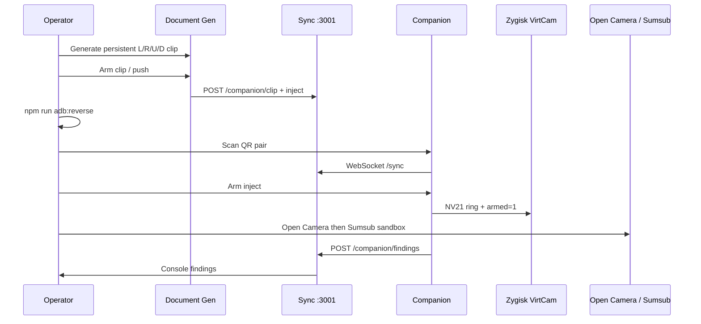

# Plan C — E2E lab validation

## Goal

Prove the **authorized** end-to-end lab path on Pixel: desktop Document Gen → arm clip → USB reverse → companion pair → Arm inject → **Open Camera** → **Sumsub sandbox**, with findings recorded and a written runbook for operators.

## Locked defaults

- Device: **Pixel**, rooted Magisk (Plan A `.so` required; Plan B fidelity preferred)
- First prove-out: **Open Camera**, then **Sumsub sandbox** (matches `android/README` operator flow)
- Stack: `pr/6-harness-inject-companion` + `pr/7-android-companion` (+ A/B)
- Skip reinventing desktop Document Gen / harness inject already in PRs 3–8
- Owned-sandbox QA only — not unauthorized intrusion

## Prerequisites

- Plan A: Open Camera can show synthetic frames when armed
- Plan B optional but preferred (profile/IMU/seam); C can proceed on A-only with noted fidelity gaps
- Desktop: Document Gen persistent L/R/U/D (`lib/harness/avatar-runway.ts`, `components/documents/*`), `lib/harness/push-clip.ts`, pair UI `components/sync/PairingPanel.tsx` / `app/(harness)/engagements/[id]/pair/page.tsx`
- Protocol: `docs/companion-protocol.md` on `pr/6` — ports **3001** `/sync`, `/companion/clip`, `/companion/inject`, `/companion/findings`
- Sumsub: **lab-owned** sandbox credentials in operator settings / vault (from console PRs) — never production customer KYC

## Architecture

## Concrete implementation steps

1. **Stack bring-up**
   - Checkout/merge branches as needed; `npm run dev:all` (or project equivalent); `cd android && ./gradlew :app:assembleDebug`; Magisk module with Plan A `.so` flashed.
   - Confirm `npm run adb:reverse` maps 3001/3000.

2. **Open Camera E2E (must pass before Sumsub)**
   - Engagement → Companion Pair → QR (`sessionId`, `token`, `ws://127.0.0.1:3001/sync`).
   - Document Gen: persistent motion → arm → push (`pushCompanionClip` / UI).
   - Companion: Arm inject; verify `desktop_to_mobile` + local clip loop writing ring.
   - Open Camera front: synthetic preview.
   - Finding button: pass/fail → console.

3. **Sumsub sandbox**
   - Same armed session; open **owned** Sumsub sandbox KYC flow on device.
   - Observe accept / retry / reject / detection signals; record via companion findings (`finding_signal` / POST findings).
   - Do not target third-party production KYC.

4. **Written lab runbook**
   - Add e.g. `docs/lab-runbook.md` (or `android/docs/lab-runbook.md`) covering:
     - Magisk flash, companion install, desktop start, adb reverse
     - Document Gen arm → pair → Arm inject
     - Open Camera checklist then Sumsub checklist
     - Troubleshooting (no `.so`, armed=0, adb reverse missing, WebRTC fail)
     - Link `docs/companion-protocol.md` and `android/README.md`

5. **Findings hygiene**
   - Confirm findings land in console surfaces from PRs 3–4 (`/findings`, engagement forensics).
   - Attach OEM_MATRIX Pixel row update if Plan B logging exists.

## Acceptance criteria

- [ ] Operator can complete Open Camera path from cold start using runbook alone
- [ ] Sumsub **sandbox** attempt recorded with outcome in console
- [ ] `docs/...` lab runbook checked in with ports, Magisk, pair, inject, findings steps
- [ ] No product code regressions required beyond glue/docs/findings wiring if gaps found
- [ ] Framing: authorized red-team lab QA of owned stacks

## Out of scope

- Building Zygisk `.so` from scratch → **Plan A**
- Samsung/Xiaomi deep hooks → **Plan B**
- One-button desktop polish / failure recovery UX → **Plan D**
- Runway `gwm1_avatars` live sessions → **Plan E**

## Handoff notes for Plan D

- Runbook friction points (multi-step arm/push/pair) become Plan D one-button targets.
- Note WebRTC / Runway failure modes observed during C for D recovery UX.
- Keep offline `gen4_turbo` Document Gen as default path until Plan E.
