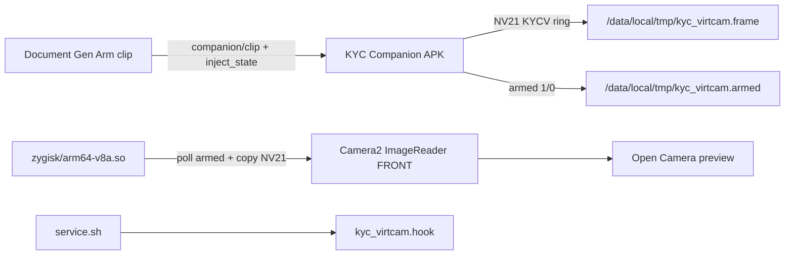

# Plan A — Virtual camera Zygisk inject

## Goal

Replace the missing Zygisk interceptor binary so third-party Camera2 apps on a **rooted Pixel (Magisk)** lab device see the companion’s armed NV21 frames. Today `VirtualCamService` + `FrameRingWriter` write `/data/local/tmp/kyc_virtcam.frame` and the Magisk module scaffolds paths — but `android/magisk-module/zygisk/README.md` states the real `.so` is **MISSING**.

## Locked defaults

- Lab device baseline: **Pixel**, rooted Magisk
- Prove-out app: **Open Camera** (before Sumsub in Plan C)
- Desktop/companion stack assumed from **`pr/6-harness-inject-companion`** + **`pr/7-android-companion`** (PRs 3–8 land or work from those branches)
- Authorized lab QA for **owned** KYC stacks only — not unauthorized intrusion
- Do **not** expand to Samsung/Xiaomi matrix (Plan B)

## Prerequisites

- Magisk installed on Pixel; USB debugging; ability to flash custom modules
- Companion APK buildable (`android/` on `pr/7`); desktop sync on `pr/6` (`npm run adb:reverse`, Document Gen arm clip → companion)
- Existing contract files present on `pr/7`:
  - `android/magisk-module/zygisk/virtcam_hook_contract.h`
  - `android/magisk-module/zygisk/README.md`
  - `android/magisk-module/module.prop` (`id=kyc_virtcam`)
  - `android/magisk-module/service.sh`
  - Kotlin producers: `FrameRingWriter.kt`, `MagiskHookBridge.kt`, `VirtualCamService.kt`

## Architecture

**Frame ring contract** (already written by companion; interceptor must match):

| Offset | Size | Field |
|--------|------|-------|
| 0 | 4 | magic `0x4B594356` (`KYCV`) |
| 4 | 4 | width |
| 8 | 4 | height |
| 12 | 4 | stride |
| 16 | 4 | format (`0` = NV21) |
| 20 | 4 | seq |
| 24 | 8 | timestampNs |
| 32 | N | NV21 payload (`width*height*3/2`) |

Also readable later (Plan B may deepen): `.profile`, `.imu`, `.seam`. Plan A minimum: **armed + frame** replace for front camera.

## Concrete implementation steps

1. **CMake / NDK Zygisk target** under `android/magisk-module/zygisk/`
   - Implement interceptor that links against Zygisk API (or Magisk-documented zygisk module layout).
   - Export / satisfy helpers declared in `virtcam_hook_contract.h`:
     - `kyc_virtcam_should_replace_front_camera()` — true when armed file is `1` and magic matches
     - `kyc_virtcam_copy_nv21(...)` — mmap/read ring, validate header, copy/convert into destination buffer
   - Hook conceptually (document exact symbols used in README):
     1. Detect FRONT lens capture session
     2. On `ImageReader.acquireLatestImage` / HAL dequeue — replace YUV/NV21 planes from ring
     3. (Stub ok for A) profile/IMU overlays — leave full fidelity to Plan B

2. **Build output**
   - Produce `android/magisk-module/zygisk/arm64-v8a.so` (Pixel lab ABI).
   - Optional `armeabi-v7a.so` only if trivial; not required for Pixel baseline.
   - Add reproducible build script (e.g. `android/magisk-module/build-zygisk.sh` or Gradle/CMake) documented in README.

3. **Module packaging**
   - Keep `module.prop` id `kyc_virtcam`.
   - Update `service.sh` so presence of `.so` is logged to `/data/local/tmp/kyc_virtcam.log` (already sketched); ensure chmod `666` on control files so companion can write.
   - Zip with `module.prop` at zip root; Magisk flash path unchanged from README.

4. **Lab prove-out (Pixel + Open Camera)**
   - Flash module → reboot → confirm `/data/local/tmp/kyc_virtcam.hook` and log says zygisk lib present.
   - Desktop: Document Gen arm clip → push; `adb reverse`; pair companion; **Arm inject**.
   - Open **Open Camera**, front camera: preview must show synthetic/loop frames.
   - Disarm: preview returns to physical camera within one session or after reopen if Camera2 caches buffers (document behavior).

5. **Docs**
   - Replace “MISSING interceptor” language in `zygisk/README.md` with build + flash + Open Camera verify checklist.
   - Note: Sumsub sandbox is **Plan C**, not A.

## Acceptance criteria

- [ ] Real `arm64-v8a.so` exists under `android/magisk-module/zygisk/` and is included in the Magisk zip
- [ ] When armed, Open Camera front preview on Pixel shows companion synthetic frames (KYCV ring), not the physical sensor
- [ ] When disarmed (`kyc_virtcam.armed` = `0`), physical front camera works
- [ ] Invalid/missing frame or wrong magic → do not crash Camera2; fall through to real buffers
- [ ] `service.sh` creates hook marker; log distinguishes “lib present” vs placeholder
- [ ] No Samsung/Xiaomi-specific forks beyond what already exists in Kotlin stubs

## Out of scope

- OEM matrix, CameraCharacteristics deep spoof, IMU SensorEventQueue hooks, LoopSeamHider hardening → **Plan B**
- Full E2E Sumsub runbook → **Plan C**
- Desktop one-button UX polish → **Plan D**
- Runway `gwm1_avatars` realtime → **Plan E**
- Reimplementing Document Gen, WebRTC pair, clip push (already on pr/5–pr/6)

## Handoff notes for Plan B

- Pixel + Open Camera must be **green** before any OEM work.
- Interceptor should expose stable reads of `.profile` / `.imu` / `.seam` paths even if Plan A only stubs overlay — Plan B will wire fidelity.
- Record Magisk / Android version used on the lab Pixel in README for OEM comparison.
- Branch hint: implement on top of `pr/7-android-companion` (or merged android tree); desktop remains `pr/6` for arm/push during prove-out.
